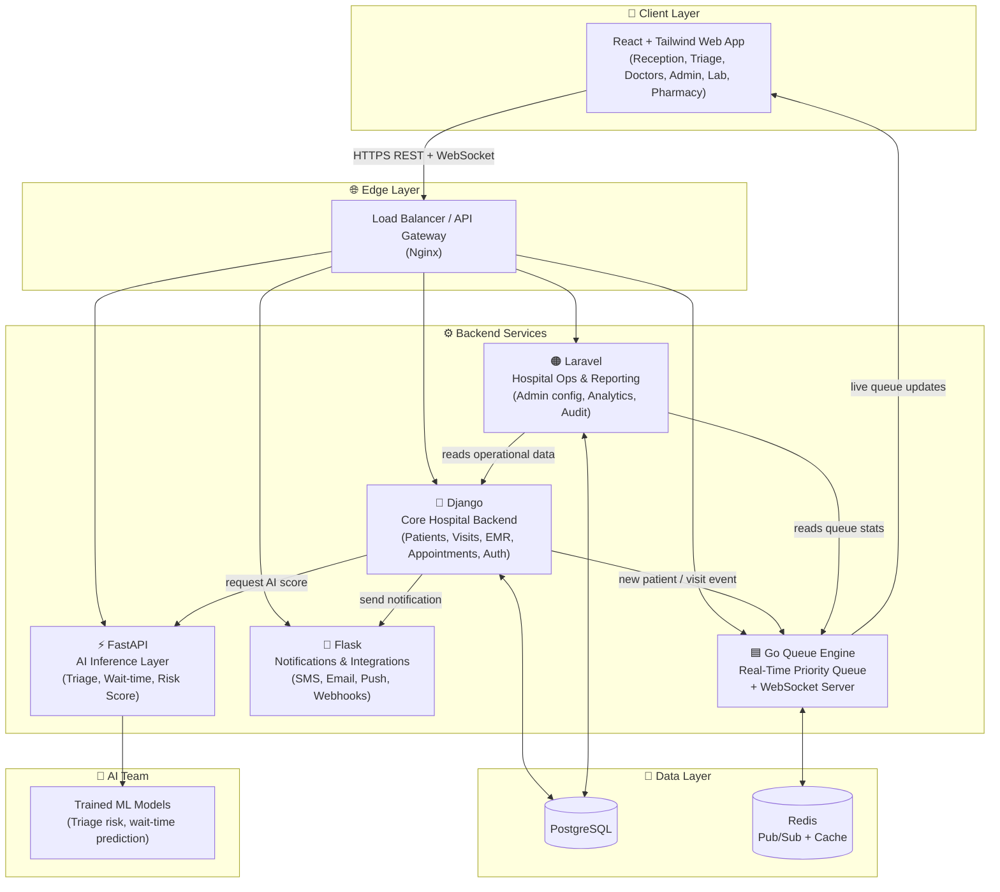
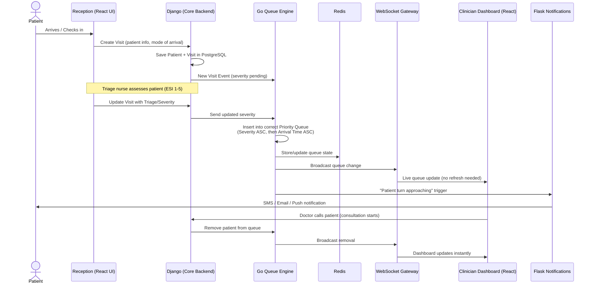
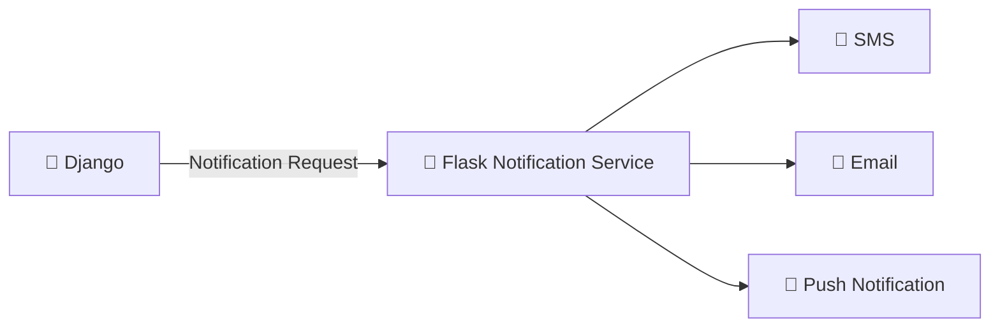
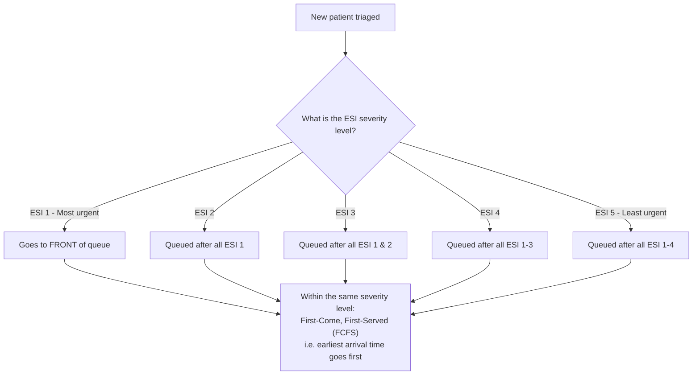
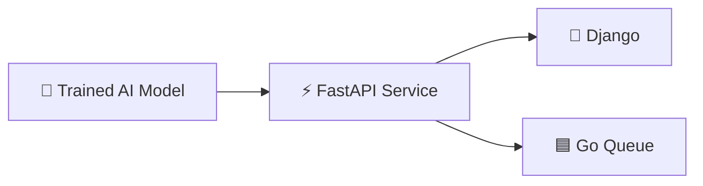
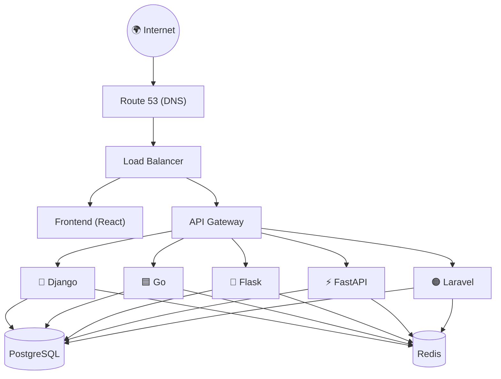
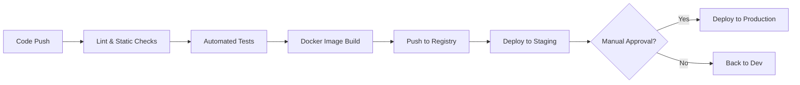
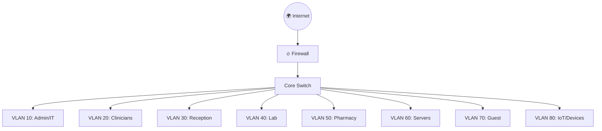
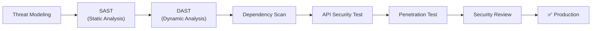

# 🏥 MediFlow — Hospital Operations & Patient-Flow Management Platform

> **A beginner-friendly, extremely detailed guide for the MediFlow project team.**
> If you are a new intern, read this document top to bottom before writing a single line of code. It explains **what MediFlow is**, **how the whole system fits together**, **what your specific team is responsible for**, and **how to get started**.

---

## 📑 Table of Contents

1. [What is MediFlow?](#1-what-is-mediflow)
2. [Big-Picture Architecture](#2-big-picture-architecture)
3. [Tech Stack Overview](#3-tech-stack-overview)
4. [How a Patient Moves Through the System](#4-how-a-patient-moves-through-the-system)
5. [Team-by-Team Breakdown](#5-team-by-team-breakdown)
   - [5.1 Frontend Team (React + Tailwind)](#51-frontend-team--react--tailwind)
   - [5.2 Django Team (Core Backend)](#52-django-team--core-hospitalbusiness-backend)
   - [5.3 Flask Team (Notifications & Integrations)](#53-flask-team--notifications--external-integrations)
   - [5.4 Golang Team (Real-Time Queue Engine)](#54-golang-team--real-time-priority-queue-engine)
   - [5.5 FastAPI Team (AI Inference Layer)](#55-fastapi-team--ai-inference-layer)
   - [5.6 AI Integration Team (Models & Intelligence)](#56-ai-integration-team--models--intelligence)
   - [5.7 Laravel Team (Hospital Ops & Reporting)](#57-laravel-team--hospital-operations--reporting)
   - [5.8 DevOps Team (Infrastructure & CI/CD)](#58-devops-team--infrastructure--cicd)
   - [5.9 Networking Team](#59-networking-team)
   - [5.10 Cybersecurity Team](#510-cybersecurity-team)
6. [The Priority Queue Logic (ESI + FCFS)](#6-the-priority-queue-logic-esi--fcfs)
7. [How Services Talk to Each Other](#7-how-services-talk-to-each-other)
8. [Suggested Repository Structure](#8-suggested-repository-structure)
9. [Getting Started (Setup Guide for Interns)](#9-getting-started-setup-guide-for-interns)
10. [Git Workflow & Branching Strategy](#10-git-workflow--branching-strategy)
11. [Security & Compliance Basics](#11-security--compliance-basics)
12. [Glossary — Terms Every Intern Should Know](#12-glossary--terms-every-intern-should-know)
13. [FAQ for New Interns](#13-faq-for-new-interns)

---

## 1. What is MediFlow?

**MediFlow** is a hospital operations and patient-flow management platform. Its goal is to solve a problem every hospital faces: **patients wait too long, and staff don't have real-time visibility into who needs to be seen next.**

MediFlow does this by:

- Registering and checking in patients digitally.
- Triaging patients (deciding how urgent their case is) using a standard severity scale.
- Placing patients into **smart, real-time priority queues** per department (Emergency, OPD, Maternity, Pediatrics, Specialist clinics).
- Giving doctors, nurses, receptionists, lab staff, and pharmacists dashboards tailored to their job.
- Notifying patients by SMS/Email/Push when their turn is close.
- Giving hospital administrators reports and analytics (waiting times, bottlenecks, workload).
- Optionally using **AI as a decision-support tool** — never as an autonomous decision-maker. A model can *suggest* "this patient looks high-risk," but a human clinician always makes the final call.

Think of it like a very smart, hospital-wide version of the "take a number" ticket system you see at a bank — except the numbers are ordered by medical urgency, not just who arrived first, and every department (not just one counter) has its own live queue.

---

## 2. Big-Picture Architecture

MediFlow is built as **several independent services that each do one job well**, all talking to each other over APIs. This is called a **microservices-style architecture**. Each service can be built, tested, and deployed by a different team without blocking everyone else.



**Why split it this way?**
- **Django** is the single source of truth for patients, visits, and medical records — the "system of record."
- **Go** is extremely fast and great at handling thousands of real-time queue updates and WebSocket connections at once — that's why it owns the live queue.
- **Flask** is small and simple — perfect for a focused notifications microservice that just sends messages.
- **FastAPI** is designed for high-performance APIs and plays nicely with Python's AI/ML ecosystem — ideal for serving AI models.
- **Laravel** is excellent for admin panels, configuration, and reporting — the "hospital management" side of things.
- **React** is the single interface every human (nurse, doctor, admin, receptionist) interacts with.

---

## 3. Tech Stack Overview

| Layer | Technology | Owned By |
|---|---|---|
| Frontend UI | React + TypeScript + Tailwind CSS | Frontend Team |
| Core backend / DB source of truth | Django + PostgreSQL | Django Team |
| Real-time queue engine | Go (Golang) + Redis + WebSockets | Golang Team |
| Notifications & integrations | Flask | Flask Team |
| AI inference API | FastAPI | FastAPI Team |
| AI models | Python (scikit-learn / PyTorch / etc.) | AI Integration Team |
| Hospital ops, admin, reporting | Laravel (PHP) | Laravel Team |
| Infrastructure, CI/CD, cloud | Docker, Kubernetes/AWS, GitHub Actions | DevOps Team |
| Network design | VLANs, Firewalls, DNS, DHCP | Networking Team |
| Security | RBAC, TLS, OWASP testing, audit logs | Cybersecurity Team |

---

## 4. How a Patient Moves Through the System

This is the most important flow to understand — almost everything the app does connects back to this journey.



**In plain English:**
1. Patient checks in → Django saves them.
2. A nurse triages them (assigns urgency level).
3. Go's queue engine sorts them into the right place in the right department's queue.
4. Everyone watching a dashboard sees the queue update **live**, thanks to WebSockets (no page refresh).
5. Flask sends the patient a text message when they're getting close to being seen.
6. When a doctor calls the patient, they're removed from the queue and everyone's dashboard updates instantly again.

---

## 5. Team-by-Team Breakdown

Pick the team that matches your skills/interest. Each section below lists: **Main Responsibility**, **Tech Used**, **Detailed Task List**, and **Deliverable**.

### 5.1 Frontend Team — React + Tailwind

**Main Responsibility:** Everything the user sees and clicks on — the entire visual experience for every role in the hospital.

**Why it matters:** Reception, nurses, doctors, lab staff, pharmacists, and admins all use *the same web app*, just with different views based on their role (Role-Based Access Control, or **RBAC**).

**Tasks:**
- [ ] Set up React + TypeScript project
- [ ] Set up Tailwind CSS
- [ ] Build a shared, responsive design system/component library
- [ ] Authentication pages: Login, Registration, Forgot Password
- [ ] Patient registration interface
- [ ] Patient check-in interface
- [ ] Patient queue/status page (shows estimated waiting time)
- [ ] Triage interface for nurses
- [ ] Clinician dashboard + live priority queue dashboard
- [ ] Appointment/calendar interface
- [ ] EMR (Electronic Medical Record) interface
- [ ] Laboratory interface
- [ ] Pharmacy interface
- [ ] Admin dashboard
- [ ] Reports/analytics dashboard
- [ ] User/role management UI
- [ ] Notifications UI
- [ ] Error/loading/empty states for every screen
- [ ] Mobile/tablet responsiveness
- [ ] Integrate all backend REST APIs (Django, Go, Flask, FastAPI, Laravel)
- [ ] Integrate WebSocket for live queue updates
- [ ] Implement frontend RBAC (hide/show features per role)
- [ ] Frontend form validation
- [ ] Accessibility (a11y) and usability testing

**Deliverable:** The complete MediFlow web application.

---

### 5.2 Django Team — Core Hospital/Business Backend

**Main Responsibility:** Django is the **single source of truth** for the application's core data — patients, visits, medical records, appointments.

**Tasks:**

*Authentication & Users*
- [ ] User registration, login/logout, password management
- [ ] User roles: `Admin → Doctor → Nurse/Triage → Reception → Lab → Pharmacy → IT`
- [ ] RBAC (Role-Based Access Control)
- [ ] Admin management

*Patient Management*
- [ ] Patient model (demographics, insurance/payment category)
- [ ] Medical history, allergies, chronic conditions
- [ ] Patient search & registration

*Visit Management*
- [ ] Visit creation & unique Visit ID generation
- [ ] Check-in, visit status, mode of arrival, department assignment

*EMR (kept intentionally simple — "EMR Lite")*
- [ ] Consultation records, diagnoses, prescriptions
- [ ] Visit notes, referral records, admission/discharge records

*Appointments*
- [ ] Doctor & clinic schedules
- [ ] Appointment creation, cancellation, status, target time windows

*Admin*
- [ ] Departments, clinics, doctors, service hours, holidays
- [ ] Triage configuration, queue configuration

*API*
- [ ] REST API + documentation
- [ ] Authentication & permission middleware
- [ ] Database migrations, PostgreSQL integration

**Deliverable:** The core MediFlow API and database.

---

### 5.3 Flask Team — Notifications & External Integrations

**Main Responsibility:** A focused microservice that owns everything related to sending messages to patients and connecting to outside systems. Flask is intentionally kept small so it doesn't duplicate what Django already does.



**Tasks:**
- [ ] Build the Flask microservice
- [ ] Notification API
- [ ] SMS integration
- [ ] Email notifications
- [ ] Push notification integration
- [ ] Appointment reminders
- [ ] Queue-turn notifications ("you're almost up")
- [ ] Delay notifications
- [ ] Emergency/prioritization alerts
- [ ] Notification templates
- [ ] Notification delivery tracking + retry failed notifications
- [ ] External healthcare integrations & webhook handlers
- [ ] Payment service integration (if required)
- [ ] Integration with external lab/pharmacy systems (future phase)

**Deliverable:** The notification + integration microservice.

---

### 5.4 Golang Team — Real-Time Priority Queue Engine

**Main Responsibility:** The high-performance, real-time brain of the queue system. This is where Go really shines — it's built for speed and concurrency.

**The core ordering rule:**



**In plain terms:** Sort by *how urgent* (severity), and if two patients are equally urgent, whoever arrived first goes first.

**Tasks:**
- [ ] Build the Go queue service
- [ ] Priority queue algorithm (severity-based ordering + FCFS)
- [ ] Department-specific queues: Emergency, OPD, Specialist, Maternity, Pediatrics
- [ ] Queue insertion, removal, reprioritization
- [ ] Patient escalation / de-escalation (severity changes mid-wait)
- [ ] Estimated waiting-time calculation
- [ ] Queue load calculation
- [ ] Real-time queue updates via WebSocket service
- [ ] Queue event broadcasting
- [ ] Redis integration (for fast, real-time state)
- [ ] Queue synchronization with Django
- [ ] Load testing (simulate hundreds of patients/events at once)

> **Note for interns:** You can implement the queue using either a database-backed ordering approach or an in-memory data structure such as a **heap**, with Redis as an optional real-time state layer. Start simple, then optimize.

**Deliverable:** The real-time queue engine.

---

### 5.5 FastAPI Team — AI Inference Layer

**Main Responsibility:** A clean separation between "the AI model" and "the rest of the system." FastAPI exposes AI capabilities as simple API endpoints.



**Potential AI endpoints:**

```
POST /ai/triage
POST /ai/wait-time
POST /ai/risk-score
POST /ai/bottleneck
GET  /ai/health
```

**Tasks:**
- [ ] Create the FastAPI service
- [ ] AI API endpoints + request validation
- [ ] Model loading & inference
- [ ] AI response formatting
- [ ] Model versioning
- [ ] AI logging & performance monitoring
- [ ] API documentation
- [ ] Authentication between services
- [ ] Rate limiting
- [ ] AI health-check endpoint

> ⚠️ **Critical design rule:** AI must **never** autonomously diagnose a patient or make a clinical decision. It only provides **decision support** — e.g., flagging a possibly high-risk case for a human clinician to review. Every AI output must be reviewed by a professional before it affects patient care.

**Deliverable:** The AI inference API.

---

### 5.6 AI Integration Team — Models & Intelligence

**Main Responsibility:** This team does **not** build another backend. Their job is the actual intelligence that FastAPI exposes to the rest of the system.

**Tasks — AI Triage:**
- [ ] Research an appropriate triage dataset
- [ ] Data cleaning & feature engineering
- [ ] Build a baseline model
- [ ] Train the model
- [ ] Evaluate the model (precision/recall)
- [ ] Test for bias
- [ ] Model validation & versioning

**Potential input features:** Age, sex, chief complaint, temperature, heart rate, blood pressure, SpO2, arrival mode, symptoms.

**Example AI decision-support output:**

```
Risk Level: HIGH

Possible concern:
- High-risk presentation

Recommendation:
- Prioritize clinical assessment

Confidence: 87%
```

**Tasks — Queue Intelligence (later phase):**
- [ ] Waiting-time prediction
- [ ] Patient-flow prediction
- [ ] Department congestion prediction
- [ ] Bottleneck detection
- [ ] Doctor workload analysis
- [ ] Demand forecasting

> These advanced analytics features are **later-phase**, not part of the MVP (Minimum Viable Product). Focus on the AI triage baseline first.

**Deliverable:** Trained models + AI decision logic.

---

### 5.7 Laravel Team — Hospital Operations & Reporting

**Main Responsibility:** The management, administrative, reporting, and operational backend of MediFlow.

**Tasks:**

*1. Admin Management*
- [ ] Admin dashboard APIs
- [ ] Department, clinic, doctor/staff management
- [ ] Service hours & holidays
- [ ] Hospital configuration
- [ ] Triage-scale configuration
- [ ] Queue-rule configuration

*2. Reporting & Analytics Backend*
- [ ] Average waiting-time calculations
- [ ] Waiting time by department / by day / by time
- [ ] Triage distribution
- [ ] Patient-volume statistics
- [ ] Department & doctor workload
- [ ] Bottleneck reports
- [ ] Daily/weekly/monthly reports
- [ ] CSV export
- [ ] PDF report generation

*3. Audit & Activity Management*
- [ ] Audit-log APIs
- [ ] Admin activity logs
- [ ] Patient-record access logs
- [ ] Configuration-change logs
- [ ] Severity-change logs
- [ ] Report-generation logs

*4. Hospital Operations*
- [ ] Department performance
- [ ] Resource, doctor & bed availability
- [ ] Operational statistics
- [ ] Clinic performance metrics (feeds dashboard cards like "patients today," "currently waiting," "emergency cases," "doctors available," "beds available")

*5. API*
- [ ] Laravel REST APIs + documentation
- [ ] Authentication/authorization integration
- [ ] Validation & error handling
- [ ] Service-to-service communication with Django and Go

**Deliverable:** Hospital operations, admin, and reporting backend.

---

### 5.8 DevOps Team — Infrastructure & CI/CD

**Main Responsibility:** Make sure everybody else's work can actually run together, reliably, in one environment.

**Tasks — Infrastructure:**
- [ ] Design deployment architecture
- [ ] Dockerize every service
- [ ] Docker Compose for local development
- [ ] PostgreSQL, Redis
- [ ] Nginx / API gateway
- [ ] Object storage
- [ ] Secrets management
- [ ] Environment configuration

**Tasks — CI/CD:**
- [ ] GitHub repository structure
- [ ] Git branching strategy
- [ ] Pull request workflow
- [ ] GitHub Actions
- [ ] Automated testing
- [ ] Build pipelines & Docker image builds
- [ ] Deployment pipelines
- [ ] Rollback strategy

**Cloud Architecture (AWS example):**



**CI/CD Pipeline:**



**Tasks — Monitoring:**
- [ ] Application logs
- [ ] Infrastructure monitoring
- [ ] Error tracking
- [ ] API latency monitoring
- [ ] CPU/memory monitoring
- [ ] Database & Redis monitoring
- [ ] Queue monitoring
- [ ] Uptime monitoring & alerts

> **Target:** ≥99% uptime during clinic hours, regular backups, disaster recovery, and graceful degradation if a service goes down.

**Deliverable:** Production-ready infrastructure + CI/CD.

---

### 5.9 Networking Team

**Main Responsibility:** Full campus/hospital network design — not just "setting up Wi-Fi."

**Network Topology Example:**



**Tasks:**
- [ ] Design hospital/campus network topology
- [ ] Design VLAN structure (per department, segmented)
- [ ] Configure routers, switches, DHCP, DNS
- [ ] Firewall rules & VPN
- [ ] Network monitoring & bandwidth management
- [ ] Redundancy planning
- [ ] Network documentation
- [ ] Reliability/failure testing: internet failure, server failure, switch failure, database failure, network congestion
- [ ] Capacity testing — the system must work on campus Wi-Fi/4G and support several hundred concurrent users

**Deliverable:** Network architecture, secure connectivity, and documentation.

---

### 5.10 Cybersecurity Team

**Main Responsibility:** Security cuts across **every** team — it is not a feature bolted on at the end. Because MediFlow handles patient data, this is one of the most important teams on the project.

**Tasks:**

*Identity & Access*
- [ ] Authentication architecture
- [ ] RBAC & privilege management
- [ ] Session security
- [ ] MFA/2FA for sensitive user roles
- [ ] Password policy

*API Security*
- [ ] API authentication (JWT/OAuth)
- [ ] API authorization & rate limiting
- [ ] Input validation, CORS policy
- [ ] API abuse protection

*Data Security*
- [ ] HTTPS/TLS everywhere
- [ ] Encryption at rest
- [ ] Database security & secret management
- [ ] PII protection & patient-data access controls

*Application Security*
- [ ] OWASP Top 10 testing
- [ ] SQL injection, XSS, CSRF testing
- [ ] Broken access-control testing
- [ ] Authentication testing
- [ ] File-upload security
- [ ] Dependency vulnerability scanning

*Audit*
- [ ] Patient record access logs
- [ ] Record modification & severity-change logs
- [ ] Login & admin activity logs
- [ ] Security incident logs

**Security Testing Pipeline:**



**Deliverable:** Security architecture + security testing + security report.

---

## 6. The Priority Queue Logic (ESI + FCFS)

MediFlow uses the **Emergency Severity Index (ESI)**, a standard 5-level triage scale used in real hospitals:

| ESI Level | Meaning | Queue Priority |
|---|---|---|
| ESI 1 | Immediately life-threatening | Seen first |
| ESI 2 | High risk, should be seen very soon | 2nd priority |
| ESI 3 | Stable, needs multiple resources | 3rd priority |
| ESI 4 | Stable, needs one resource | 4th priority |
| ESI 5 | Stable, needs no resources | Seen last |

Within the same ESI level, patients are ordered **First-Come, First-Served (FCFS)** — earliest arrival goes first.

---

## 7. How Services Talk to Each Other

| From → To | Purpose | Protocol |
|---|---|---|
| React → Django/Go/Flask/FastAPI/Laravel | Standard CRUD operations, forms, dashboards | REST (HTTPS) |
| React ↔ Go | Live queue updates | WebSocket |
| Django → Go | New patient / severity update events | REST / message event |
| Django → Flask | "Send this notification" request | REST |
| Django → FastAPI | "Give me a risk score for this patient" | REST |
| Go ↔ Redis | Store & broadcast real-time queue state | Redis Pub/Sub |
| Laravel → Django/Go | Pull operational & queue data for reports | REST |

---

## 8. Suggested Repository Structure

```
mediflow/
├── frontend/               # React + TypeScript + Tailwind
├── backend-django/         # Core hospital backend (patients, visits, EMR)
├── backend-go/             # Real-time queue engine + WebSocket server
├── backend-flask/          # Notifications & integrations microservice
├── backend-fastapi/        # AI inference API
├── ai-models/              # Model training, notebooks, evaluation (AI Integration Team)
├── backend-laravel/        # Admin, reporting, ops backend
├── infrastructure/         # Docker, Kubernetes/AWS configs, CI/CD pipelines
├── networking/             # Network diagrams & configuration docs
├── security/               # Threat models, audit policies, test reports
├── docs/                   # Architecture diagrams, SRS, meeting notes
└── README.md                # ← You are here
```

---

## 9. Getting Started (Setup Guide for Interns)

**Prerequisites to install (based on your team):**

| Tool | Needed By |
|---|---|
| Git | Everyone |
| Node.js + npm/yarn | Frontend Team |
| Python 3.11+ | Django, Flask, FastAPI, AI teams |
| Go 1.21+ | Golang Team |
| PHP 8+ & Composer | Laravel Team |
| PostgreSQL | Django, Laravel |
| Redis | Golang Team |
| Docker & Docker Compose | Everyone (DevOps sets this up) |

**Basic steps for every intern:**

1. Ask your team lead / DevOps for access to the GitHub repository.
2. Clone the repo:
   ```bash
   git clone https://github.com/your-org/mediflow.git
   cd mediflow
   ```
3. Navigate into your team's folder (e.g. `cd backend-django`).
4. Follow the `README.md` inside that specific folder for exact setup steps (each service will have its own instructions once created).
5. Run the project locally using Docker Compose (once DevOps has it ready):
   ```bash
   docker compose up
   ```
6. Ask questions in the team chat — there are no "silly questions" when you're new.

---

## 10. Git Workflow & Branching Strategy

- `main` → always stable, production-ready code only.
- `develop` → integration branch where features come together.
- `feature/<team>-<short-description>` → e.g. `feature/django-patient-model`.
- Every change goes through a **Pull Request (PR)** — no direct pushes to `main` or `develop`.
- At least one teammate must review and approve a PR before it's merged.
- Write clear commit messages: `feat: add patient registration endpoint` not `fix stuff`.

---

## 11. Security & Compliance Basics

Because MediFlow stores real patient information, every intern — regardless of team — must follow these baseline rules:

- **Never** commit passwords, API keys, or secrets to Git.
- **Never** log sensitive patient data (e.g., full medical history) in plaintext logs.
- Always use HTTPS/TLS, even in development where possible.
- Follow the principle of **least privilege** — only request the access your role actually needs.
- All patient data handling should keep data-protection regulations in mind (e.g. Nigeria Data Protection Act principles: consent, minimal data collection, secure storage).

---

## 12. Glossary — Terms Every Intern Should Know

| Term | Meaning |
|---|---|
| **RBAC** | Role-Based Access Control — restricting what a user can see/do based on their role |
| **EMR** | Electronic Medical Record |
| **ESI** | Emergency Severity Index — 5-level triage urgency scale |
| **FCFS** | First-Come, First-Served |
| **SRS** | Software Requirements Specification |
| **MVP** | Minimum Viable Product — the smallest version of the product that's actually usable |
| **JWT** | JSON Web Token — a way to securely pass identity info between services |
| **WebSocket** | A connection that lets a server push live updates to a browser without refreshing |
| **Pub/Sub** | "Publish/Subscribe" — a messaging pattern where one service broadcasts events and others "listen" |
| **CI/CD** | Continuous Integration / Continuous Deployment — automated testing & deployment pipelines |
| **VLAN** | Virtual Local Area Network — a way to logically separate network traffic |
| **OWASP Top 10** | The 10 most critical web application security risks, maintained by the OWASP foundation |
| **SAST / DAST** | Static / Dynamic Application Security Testing |
| **PII** | Personally Identifiable Information |

---

## 13. FAQ for New Interns

**Q: I don't know which team to join. What should I do?**
A: Think about what excites you: visuals & UI → Frontend. Data modeling & business logic → Django or Laravel. Speed & concurrency → Go. Simplicity & focused microservices → Flask. AI/ML → FastAPI + AI Integration. Infrastructure & automation → DevOps. Networks → Networking. Breaking things (safely) → Cybersecurity.

**Q: Do I need to know the whole stack?**
A: No. Focus on your team's tech first. Understanding this README's architecture diagrams is enough to know how your piece fits into the whole.

**Q: What if my task depends on another team's work that isn't done yet?**
A: Use **mock data** or a **stub API** so you can keep building without being blocked. Coordinate with the other team on the expected data shape (the "contract" between services).

**Q: Where do I ask questions?**
A: Your team channel first, then the general project channel if no one on your team can help.

**Q: Is this the final architecture?**
A: This is the working plan. As the project grows, some decisions may change — always check with your team lead for the latest version of this document.

---

*This README is a living document — update it as the project evolves so future interns have an accurate, easy-to-follow guide.*
